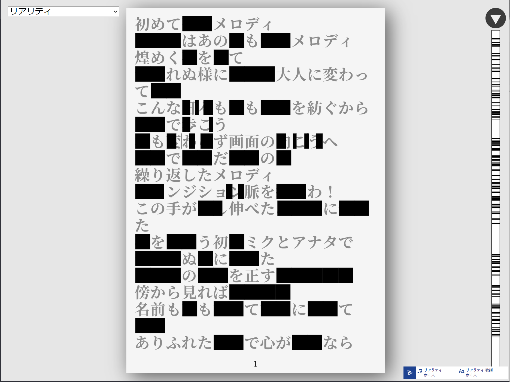

# # 静限開除
## 概要
- [初音ミク「マジカルミライ 2024」 プログラミング・コンテスト](https://magicalmirai.com/2024/procon/)応募作品です
- 対象となる6曲全てに対応しており、ドロップダウンメニューから切り替え可能です
- コンセプトは**制限と自由**で、選択された曲の歌詞がデフォルトでは**黒塗り**状態になっており当該箇所の再生中は規制音が鳴る(**制限**)のを、ユーザーの手によって取り除く(**自由**)アプリケーションとなります

## 使い方
- 画面左上のドロップダウンメニューから曲を選べます
- 歌詞上に存在する黒塗り部分をドラッグすることで規制を除去できます
- 画面右のコントロールバーで再生状況を操作できます

## 動作環境
ひとまず以下の環境で動作を確認しています:
- Windows(Chrome, Firefox)
- iOS(Chrome, Safari)
- Android(Chrome)

ただし安定性にはムラがあり、簡単に表記すると`Windows(Chrome)>Windows(Firefox)>>Android>>>>>>>iOS(Chrome)>>>iOS(Safari)`といったところです

## ビルドなど
- 基本的に[TextAlive公式のp5.js作例](https://github.com/TextAliveJp/textalive-app-p5js)のコードを改造して作成したので、当該リポジトリと同じ感じにコマンドを打てば動くはずです
  - ex. `npm run build`でビルド
  - 周辺環境もそのままなのでParcelでビルドすることになります
- 開発中は`npm run dev`したうえで[Localtunnel](https://theboroer.github.io/localtunnel-www/)上で`localhost:1234`を解放してTextAliveに登録することでテストしていました
  - 最初は公式ドキュメントにあったngrokを使っていましたが、早くも帯域制限に達したためLocaltunnelに切り替えた形です
  - コンテストの応募規約上完全な公開ページとしてのテストは行っていませんが多分動くと思います

## 使用ライブラリ
- `parcel`
- `p5`
- `textalive-app-api`
